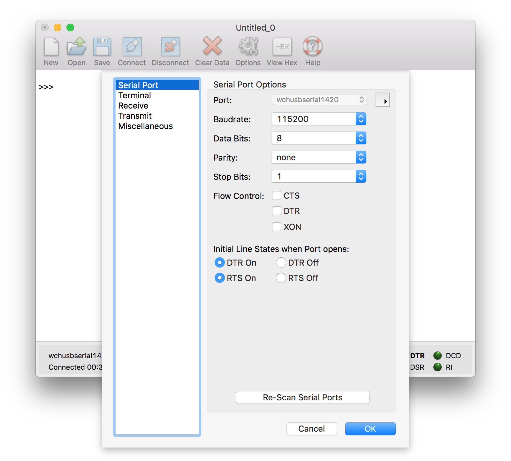
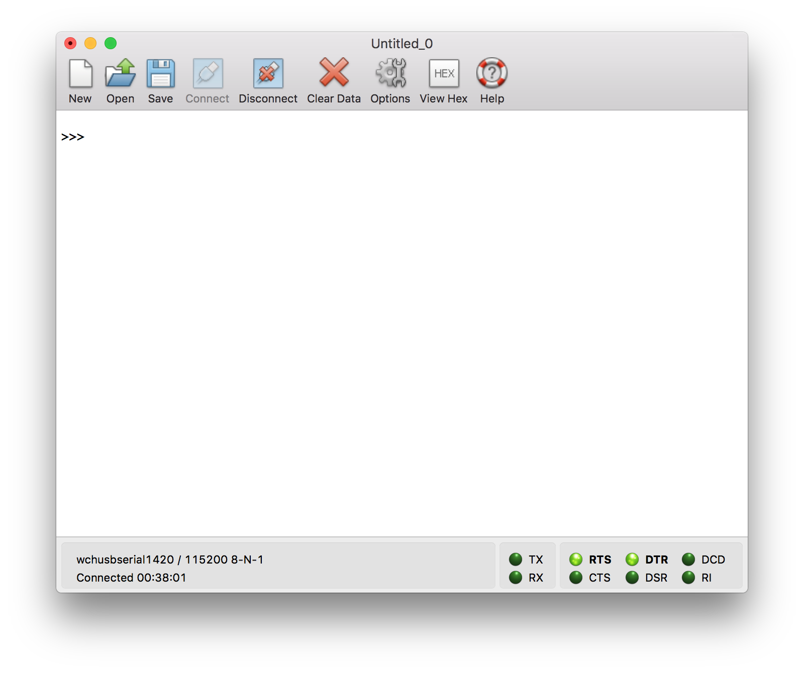

# upython

## Herramientas de terminal

### Linux

* picocom
* minicom

#### Usando *picocom*

```bash
picocom /dev/ttyUSB0 -b 115200
```
* <kbd>Control</kbd>-<kbd>a</kbd> <kbd>Control</kbd>-<kbd>x</kbd> SALIR
* <kbd>Control</kbd>-<kbd>a</kbd> <kbd>Control</kbd>-<kbd>c</kbd> LOCAL ECHO
* <kbd>Control</kbd>-<kbd>d</kbd> NODEMCU SOFT REBOOT


### MacOS

### CoolTerm

Para descargar CoolTerm Puede hacerse desde el siguiente [enlace](http://freeware.the-meiers.org/CoolTermMac.zip)

Una vez descargado e instalado, se configurará el puerto a utilizar; pulsando en el botón _Options_.



Una vez configurado el puerto (con el que nos aparece en nuestro MAC) y configurado el baudrate a _115200_. Pulsaremos OK y al botón _connect_. Apareciendo el promt de Python.


### Windows


## Pinout del NodeMCU


