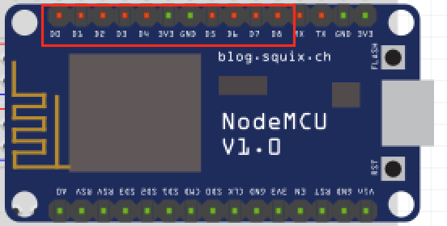
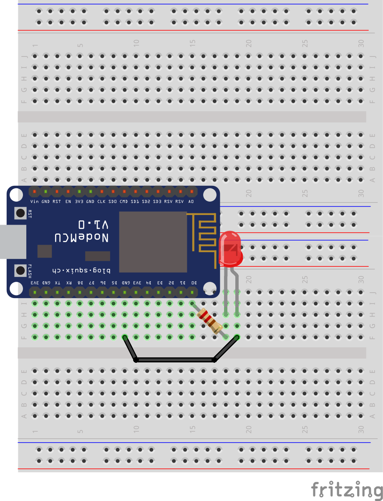
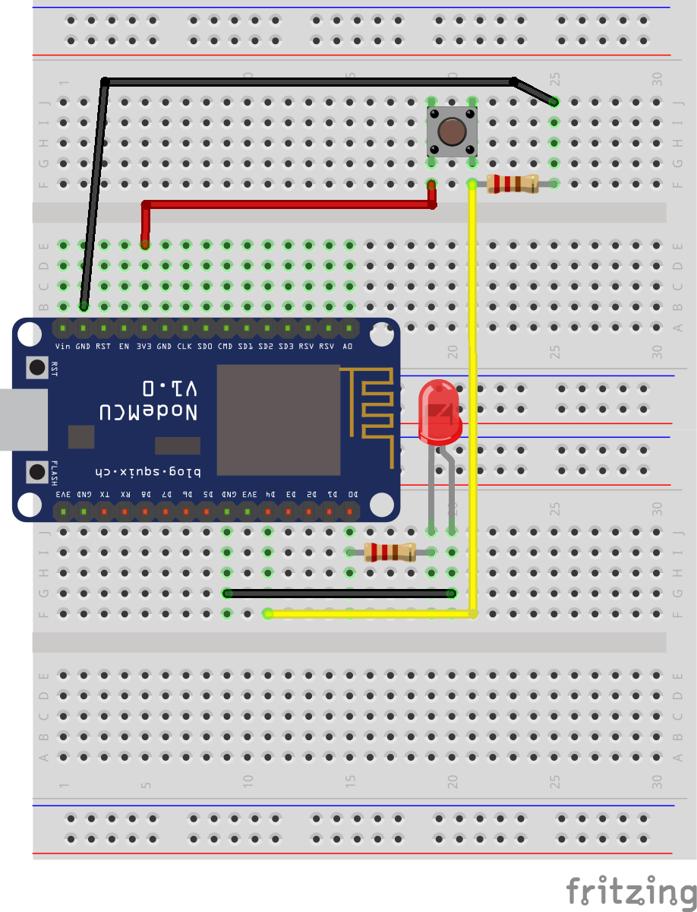
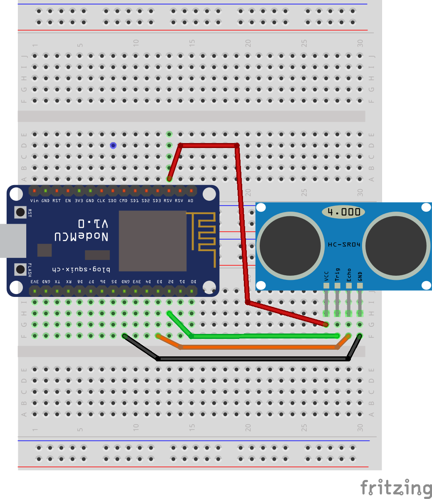

# upython

## Contenidos del curso

* [Pasos Previos](#pasos-previos)
* [Primeros pasos con MicroPython](#primeros-pasos)
* [Entrada/Salida Digital](#entradasalida-digital)
* [Entrada/Salida Analógica](#entradasalida-analogica)
* [Pinout de NodeMCU](#pinout-del-nodemcu)
## Pasos Previos

Antes de poder instalar MicroPython, necesitaremos tener instalado Python 3.4 o superior.

### Instalación

Para poder instalar MicroPython, descargaremos el firmware de la [Página oficial](http://micropython.org/download#esp8266) (Descargar el firmware para el chip correspondiente al ESP8266). Una vez descargado vamos a instalar las herramientas necesarias para flashear el chip con el firmware de MicroPython.


#### Linux

Utilizando la herramienta _pip_ instalamos la herramienta _esptool_.

```bash
$ pip install esptool
```

Una vez instalado vamos a borrar la memoria flash del chip.

```bash

$ esptool.py --port /dev/ttyUSB0 erase_flash
```

Donde _/dev/ttyUSB0_ es el puerto serie donde se encuentre conectada la placa.

Una vez hecho esto vamos a pasar a flashear el firmware en la placa.

```bash
$ esptool.py --port /dev/ttyUSB0 --baud 460800 write_flash --flash_size=detect 0 esp8266-20170108-v1.9.2.bin
```

Donde tenemos que poner el puerto donde esta conectado la velocidad en baudios (en algunas placas puede haber problemas de comunicación si la velocidad es muy alta; recomendamos poner 115200 baudios). Además de poner el nombre del fichero del firmware.

#### MacOs

En MacOs la operación es la misma; sin embargo es necesario instalar los drivers del chip de comunicación USB CH340/CH341. Los cuales podemos descargar [aquí](http://www.mblock.cc/docs/run-makeblock-ch340-ch341-on-mac-os-sierra/).

Una vez instalado ya podremos ver el puerto serie en nuestro sistema.

El resto de pasos, se realizan de igual forma que para Linux.


#### Windows

Para windows también debemos instalar los drivers CH340/CH341; que podemos encontrar en la web del [fabricante](http://www.wch.cn/download/CH341SER_EXE.html).

Una vez instalado, usaremos los mismos pasos que para Linux poniendo el puerto COM correspondiente.


### Herramientas de terminal

#### Linux

* picocom
* minicom

##### Usando *picocom*

```bash
picocom /dev/ttyUSB0 -b 115200
```
* <kbd>Control</kbd>-<kbd>a</kbd> <kbd>Control</kbd>-<kbd>x</kbd> SALIR
* <kbd>Control</kbd>-<kbd>a</kbd> <kbd>Control</kbd>-<kbd>c</kbd> LOCAL ECHO
* <kbd>Control</kbd>-<kbd>d</kbd> NODEMCU SOFT REBOOT


#### MacOS

Para conectarnos a la placa, usaremos _coolTerm_.

##### CoolTerm

Para descargar CoolTerm Puede hacerse desde el siguiente [enlace](http://freeware.the-meiers.org/CoolTermMac.zip)

Una vez descargado e instalado, se configurará el puerto a utilizar; pulsando en el botón _Options_.


Una vez configurado el puerto (con el que nos aparece en nuestro MAC) y configurado el baudrate a _115200_. Pulsaremos OK y al botón _connect_. Apareciendo el promt de Python.


#### Windows


## Primeros Pasos

Una vez tenemos ya micropython, usaremos la consola serie para mandar las instrucciones Python; de forma que podremos ejecutar nuestro código python en la NodeMCU.


Podemos comprobar la version y el estado de nuestro firmware con el siguiente código.

```python

import esp
esp.check_fw()

```


## Entrada/salida Digital

Lo principal a la hora de trabajar con electrónica, es poder utilizar las entradas/salidas digitales que nos proveen los distintos microcontroladores; es por esto que micropython permite trabajar con entradas/salidas digitales.

Una entrada/salida digital, permite mandar o recibir un pulso binario es decir, un 0 o un 1, apagado o encendido.

Otros aspecto importante es saber que es una entrada o una salida con respecto a electrónica.

* Una entrada es un puerto que permite recibir una señal.

* Una salida es un puerto que permite lanzar una señal.

En la placa NodeMCU que utilizamos en este curso, podemos ver que tiene una serie de salidas digitales que van desde el 0 al 8; que son las cuales tienen una D al lado.



**NOTA**: A parte de estas entradas/salidas MicroPython permite utilizar otras entradas/salidas como digitales.

Para poder realizar esto, tenemos que saber la configuración de nuestra placa. En nuestro caso la NodeMCU; ya que micropython, no utiliza la misma nomenclatura que nuestra placa.

Micropython utiliza los GPIO de la placa para poder saber a qué puerto utilizar.

Para saber que puerto utilizar consultar el [Pinout de la NodeMCU](#pinout-del-nodemcu)

Por ejemplo, para usar el puerto D0, tenemos que usar el GPIO16.

Para poder usar los distintos puertos, tenemos que instanciar un objeto de la clase _Pin_.

```python
import machine 

pin = machine.Pin(16)
```

Otro aspecto a tener en cuenta es definir si el puerto será de entrada o de salida.

* Si es de salida, utilizaremos la constante _OUT_.
* Si es de entrada, utilizaremos la constante _IN_, seguido de la constante _PULL_UP_; la cual activa una resistencia interna para evitar cortocirtuitos.

```python
from machine import Pin

pout= Pin(16,Pin.OUT)
pin= Pin(4,Pin.IN,Pin.PULL_UP)
```
Sabiendo esto, ya podemos crear nuestro primer montaje, comunmente conocido como Blink u Hola Mundo.

### Primer Ejercicio: El Blink

Este primer montaje hará que un led parpadee.

Para este montaje necesitaremos:

* 1 NodeMCU
* 1 Led
* 1 resistencia 220 Ohmios
* cable de conexion.
* cable MicroUsb.

**Ejemplo del Blink**




Código:

```python
from machine import Pin
import time
led=Pin(16,Pin.OUT)

while True:
    led.on()
    time.sleep(0.5)
    led.off()
    time.sleep(0.5)
```
En el ejemplo anterior, vemos que creamos un objeto de la clase Pin que asignamos al GPIO16, correspondiente al puerto D0 en modo salida.

Usando la función ```on()``` u ```off()``` podemos apagar o encender el led.

Este es un ejemplo de salida digital; seguidamente mostraremos un ejemplo de entrada digital. En este caso, el uso de pulsadores.

**NOTA:** La función ```sleep()``` del módulo ```time``` hace que se espere el tiempo pasado por parámetro en segundos.

### Pulsadores

Un pulsador es un ejemplo de entrada digital; ya que permite mandar un pulso (1) o ausencia de él (0); a partir de pulsarlo o no.

Para este montaje necesitaremos:

* 1 NodeMCU
* 1 pulsador
* 2 Resistencias 220 Ohmios
* 1 led
* cables de conexión
* cable microUsb.

**Ejemplo de Pulsadores**




Código:

```python
from machine import Pin
import time

button=Pin(2,Pin.IN,Pin.PULL_UP)
led=Pin(16,Pin.OUT)

while True:
    state=button.value()
    led.value(state)
    time.sleep(0.5)


```
En este ejemplo, definimos 2 Pines de forma que uno es de entrada y otro de salida. En función del valor del primer led, encendemos o no el segundo.


## Entrada/Salida Analogica

Una vez vistos las entrada y salidas digitales, pasaremos a ver las analógicas; de forma que podamos mandar un valor distintos de 0 o 1.

En el caso del ESP8266, como otros tantos MicroControladores, nos permite mandar o recibir valores analógicos.

### Entradas Analógicas

La NodeMCU, permite recibir datos analógicos a través de un ADC (Analog DIgital Converter); de manera que toma el valor analógico y lo trasnforma a digital de forma que obtiene una serie de niveles de voltaje en función del valor obtenido.

Por eso utilizaremos la clase _ADC_; que nos permite leer de una de las entradas analógicas.

```python
from machine import ADC

adc= ADC(0)

adc.read()
```

Con este código, podemos leer de una entrada analógica; en este caso la 0(la NodeMCU solo tiene una entrada analógica).

En el caso de la NodeMCU tiene un ADC de manera que tiene una precisión de 10 bits. Esto quiere decir, que podemos detectar cambios de valores de entre 0 y 1023.

Para realizar este montaje:

* 1 NodeMCU
* 1 Potenciometro
* Cables de Conexión
* Cable MicroUSB.

**Ejemplo de lectura Analógica**


Código

```python

from machine import ADC

adc = ADC(0)

while True:
    print(adc.read())

```

**NOTA:** Para parar la ejecución, pulsaremos <kbd>control</kbd>+<kbd>c</kbd>.

### PWM

```python
import machine

pwm=machine.PWM(machine.Pin(4))
pwm.freq(60)

while True:
    for i in range(1024):
        pwm.duty(i)

```
## Sensores

### Subida de ficheros con [mpfshell](#referencias)

```bash
$pip install mpfshell
```
### Libreria para el sensor de ultrasonidos (HC-SR04)

Librería para micropython [ultrasonic.py](https://raw.githubusercontent.com/mithru/MicroPython-Examples/master/08.Sensors/HC-SR04/ultrasonic.py)

```bash
mpfshell -c "put ultrasonic.py"
```




```python
from ultrasonic import Ultrasonic

ultra = Ultrasonic(0,4)

while True:
    print(ultra.distance_in_cm())

```

## ESP8266

Como hemos mencionado anteriormente, en la NodeMCU tiene un Chip ESP8266 el cual tiene unas cracterísticas especificas que otros microcontroladores no tienen. Como por ejemplo el poder unirnos a una WIfi o crear un punto de acceso.

### Conectarse a una Wifi

### Crear un punto de acceso

### crear un servidor Web

### Funciones especificas del ESP8266


## WebREPL

## Proyecto final

## Pinout del NodeMCU


## Referencias

* MicroPython Documentacion Oficial
* AdaFruit MicroPython Tutorial
* https://github.com/wendlers/mpfshell
* Anaconda