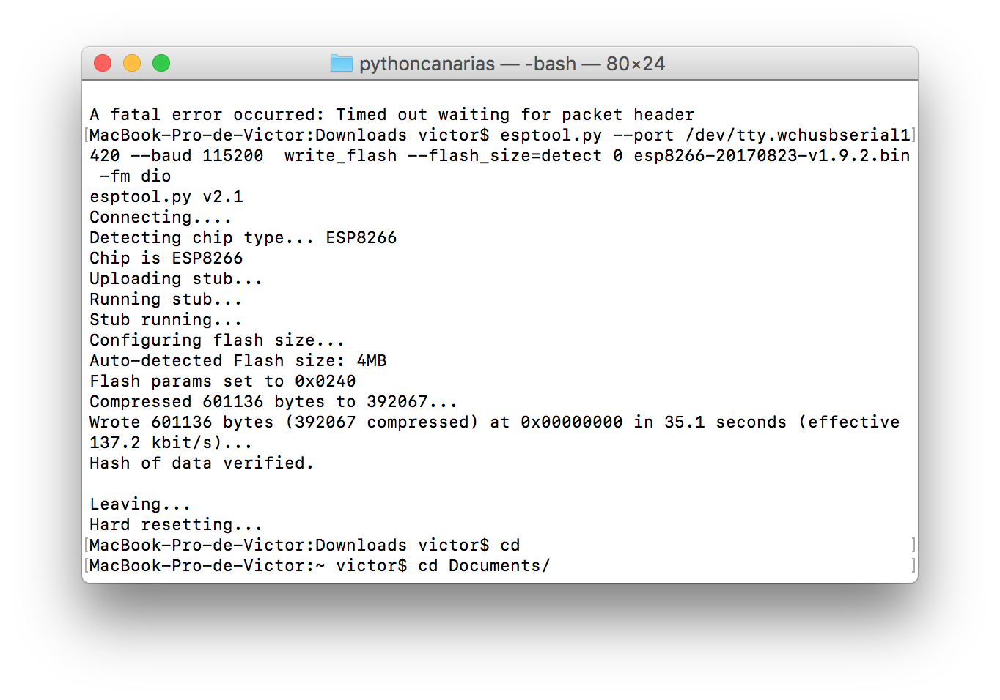
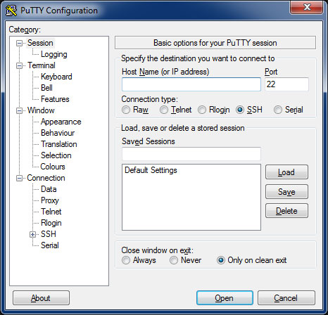
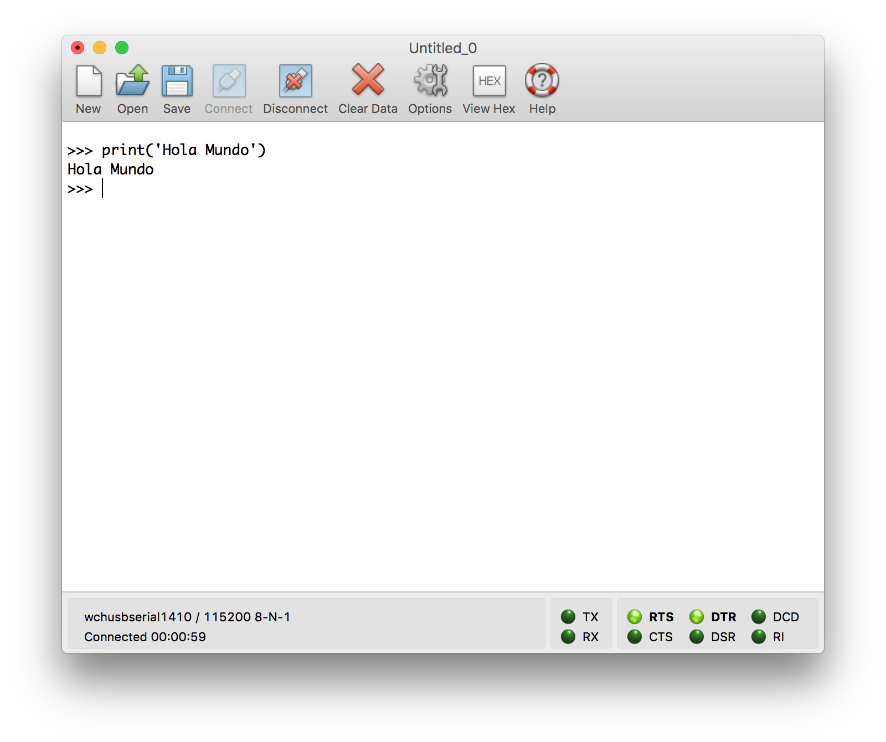
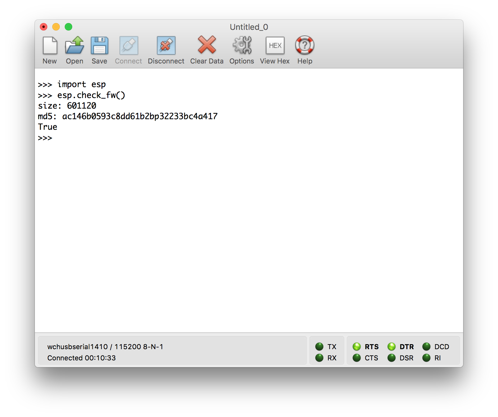
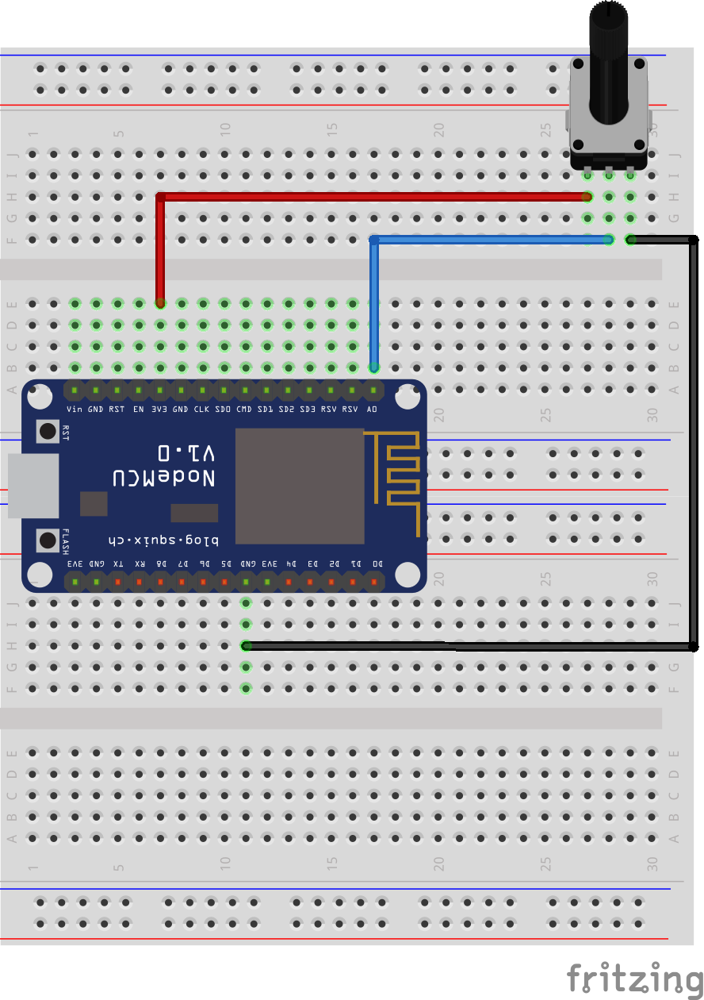
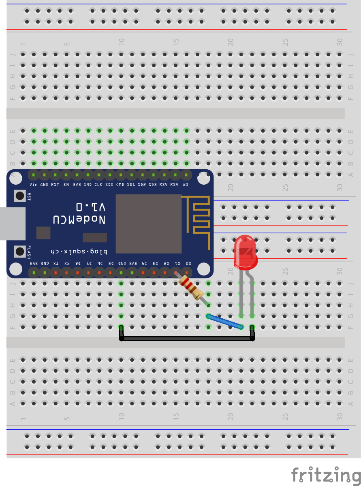
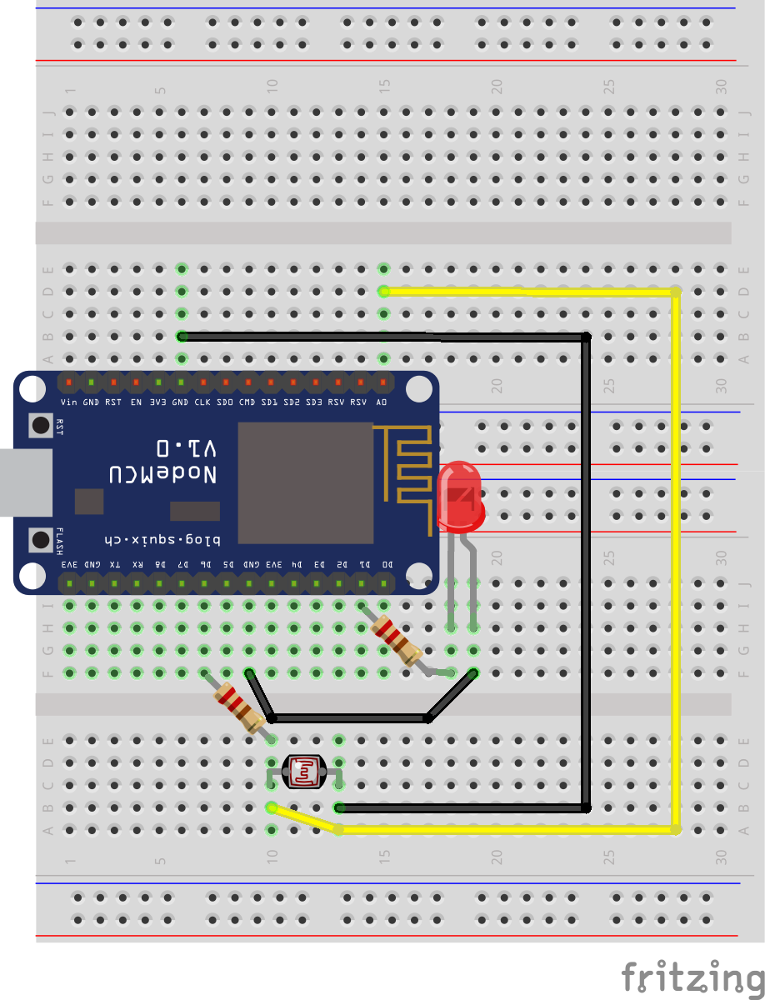

# upython
 
 Curso sobre MicroPython del día 30 de septiembre.

## Contenidos del curso

* [Pasos Previos](#pasos-previos)
* [Que es MicroPython](#que-es-micropython)
* [Primeros pasos con MicroPython](#primeros-pasos)
* [Entrada/Salida Digital](#entradasalida-digital)
* [Entrada/Salida Analógica](#entradasalida-analogica)
* [Sensores](#sensores)
* [ESP8266](#esp8266)
* [Proyecto Final](#proyecto-final)
* [Pinout de NodeMCU](#pinout-del-nodemcu)


## Pasos Previos

Antes de poder instalar MicroPython, necesitaremos tener instalado Python 3.4 o superior.

### Instalación

Para poder instalar MicroPython, descargaremos el firmware de la [Página oficial](http://micropython.org/download#esp8266) (Descargar el firmware para el chip correspondiente al ESP8266). Una vez descargado vamos a instalar las herramientas necesarias para flashear el chip con el firmware de MicroPython.


#### Linux

Utilizando la herramienta _pip_ instalamos la herramienta _esptool_.

```bash
$ pip install esptool
```

Una vez instalado vamos a borrar la memoria flash del chip.

```bash

$ esptool.py --port /dev/ttyUSB0 erase_flash
```

Donde _/dev/ttyUSB0_ es el puerto serie donde se encuentre conectada la placa.

Una vez hecho esto vamos a pasar a flashear el firmware en la placa.

```bash
$ esptool.py --port /dev/ttyUSB0 --baud 460800 write_flash --flash_size=detect 0 esp8266-20170108-v1.9.2.bin
```

Donde tenemos que poner el puerto donde esta conectado la velocidad en baudios (en algunas placas puede haber problemas de comunicación si la velocidad es muy alta; recomendamos poner 115200 baudios). Además de poner el nombre del fichero del firmware.

#### MacOs

En MacOs la operación es la misma; sin embargo es necesario instalar los drivers del chip de comunicación USB CH340/CH341. Los cuales podemos descargar [aquí](http://www.mblock.cc/docs/run-makeblock-ch340-ch341-on-mac-os-sierra/).

Una vez instalado ya podremos ver el puerto serie en nuestro sistema.

El resto de pasos, se realizan de igual forma que para Linux.



#### Windows

Para windows también debemos instalar los drivers CH340/CH341; que podemos encontrar en la web del [fabricante](http://www.wch.cn/download/CH341SER_EXE.html).

Una vez instalado, usaremos los mismos pasos que para Linux poniendo el puerto COM correspondiente.

**NOTA**: Si no es capaz de encontrar el path de PYthon probar con el siguiente comando.

```bash
$ python -m esptool <lista de parametros>
```


### Herramientas de terminal

#### Linux

* picocom
* minicom

##### Usando *picocom*

```bash
picocom /dev/ttyUSB0 -b 115200
```
* <kbd>Control</kbd>-<kbd>a</kbd> <kbd>Control</kbd>-<kbd>x</kbd> SALIR
* <kbd>Control</kbd>-<kbd>a</kbd> <kbd>Control</kbd>-<kbd>c</kbd> LOCAL ECHO
* <kbd>Control</kbd>-<kbd>d</kbd> NODEMCU SOFT REBOOT


#### MacOS

Para conectarnos a la placa, usaremos _coolTerm_.

##### CoolTerm

Para descargar CoolTerm Puede hacerse desde el siguiente [enlace](http://freeware.the-meiers.org/CoolTermMac.zip)

Una vez descargado e instalado, se configurará el puerto a utilizar; pulsando en el botón _Options_.


Una vez configurado el puerto (con el que nos aparece en nuestro MAC) y configurado el baudrate a _115200_. Pulsaremos OK y al botón _connect_. Apareciendo el promt de Python.


#### Windows

Para poder conectarnos via serial a nuestra placa NodeMCU, utilizaremos el famoso programa Putty; el cual podemos descargarnos [aquí](http://www.putty.org)

Una vez descargado el programa lo abriremos y seleccionaremos la conexion por serial.



En la dirección escribiremos el puerto al que nos conectaremos (COMX) y en la velocidad pondremos 11520. 

Si requeririeramos una configuración mayor podemos ir al apartado serial y configurar nuestra placa.


Una vez hecho esto, ya podemos continuar trabajando con nuestra placa.

### Otros IDES

Además de utilizar estas herramientas para conectarnos, podemos usar algunos IDES como _UpyCraft_ o _Pycharm_:

**UPyCraft**

UPyCraft es un pequeño ide que permite conectar a nuestra placa ESP8266 o ESP32 para poder desarrollar con MicroPython.

Puede descargarse del siguiente [enlace](https://github.com/DFRobot/uPyCraft)


**Pycharm Plugin de MicroPython**

Podemos usar un plugin para _pycharm_ para conectar con nuestra placa ESP y trabajar con MicroPython.

Puede verse más información en este [enlace](https://blog.jetbrains.com/pycharm/2018/01/micropython-plugin-for-pycharm/)


## Que es MicroPython

MicroPython es una implementacion del standar de Python 3.4(un conjunto de esta); además de tener una serie de librerías o framework para que sea ejecutado en microcontroladores.

MicroPython permite ser ejecutado en distintas placas con varios microcontroladores. 

En nuestro caso, utilizaremos la placa NodeMCU con el microcontrolador ESP8266.

Para saber que placas son compatibles mirar en la [documentación oficial](http://docs.micropython.org).

## Primeros Pasos

Una vez tenemos ya micropython, usaremos la consola serie para mandar las instrucciones Python; de forma que podremos ejecutar nuestro código python en la NodeMCU.



Podemos comprobar la version y el estado de nuestro firmware con el siguiente código.

```python

import esp
esp.check_fw()

```



## Entrada/salida Digital

Lo principal a la hora de trabajar con electrónica, es poder utilizar las entradas/salidas digitales que nos proveen los distintos microcontroladores; es por esto que micropython permite trabajar con entradas/salidas digitales.

Una entrada/salida digital, permite mandar o recibir un pulso binario es decir, un 0 o un 1, apagado o encendido.

Otros aspecto importante es saber que es una entrada o una salida con respecto a electrónica.

* Una entrada es un puerto que permite recibir una señal.

* Una salida es un puerto que permite lanzar una señal.

En la placa NodeMCU que utilizamos en este curso, podemos ver que tiene una serie de salidas digitales que van desde el 0 al 8; que son las cuales tienen una D al lado.


**NOTA**: A parte de estas entradas/salidas MicroPython permite utilizar otras entradas/salidas como digitales.

Para poder realizar esto, tenemos que saber la configuración de nuestra placa. En nuestro caso la NodeMCU; ya que micropython, no utiliza la misma nomenclatura que nuestra placa.

Micropython utiliza los GPIO de la placa para poder saber a qué puerto utilizar.

Para saber que puerto utilizar consultar el [Pinout de la NodeMCU](#pinout-del-nodemcu)

Por ejemplo, para usar el puerto D0, tenemos que usar el GPIO16.

Para poder usar los distintos puertos, tenemos que instanciar un objeto de la clase _Pin_.

```python
import machine 

pin = machine.Pin(16)
```

Otro aspecto a tener en cuenta es definir si el puerto será de entrada o de salida.

* Si es de salida, utilizaremos la constante _OUT_.
* Si es de entrada, utilizaremos la constante _IN_, seguido de la constante _PULL_UP_; la cual activa una resistencia interna para evitar cortocirtuitos.

**NOTA**: Una resistencia PULL_UP, permite evitar falsos positivos ya que permite dar un valor erroneo a la hora de utilizar las entradas o salidas.

```python
from machine import Pin

pout= Pin(16,Pin.OUT)
pin= Pin(4,Pin.IN,Pin.PULL_UP)
```
Sabiendo esto, ya podemos crear nuestro primer montaje, comunmente conocido como Blink u Hola Mundo.

### Primer Ejercicio: El Blink

Este primer montaje hará que un led parpadee.

Para este montaje necesitaremos:

* 1 NodeMCU
* 1 Led
* 1 resistencia 220 Ohmios
* cable de conexion.
* cable MicroUsb.

**Ejemplo del Blink**


Código:

```python
from machine import Pin
import time
led=Pin(16,Pin.OUT)

while True:
    led.on()
    time.sleep(0.5)
    led.off()
    time.sleep(0.5)
```
En el ejemplo anterior, vemos que creamos un objeto de la clase Pin que asignamos al GPIO16, correspondiente al puerto D0 en modo salida.

Usando la función ```on()``` u ```off()``` podemos apagar o encender el led.

Este es un ejemplo de salida digital; seguidamente mostraremos un ejemplo de entrada digital. En este caso, el uso de pulsadores.

**NOTA:** La función ```sleep()``` del módulo ```time``` hace que se espere el tiempo pasado por parámetro en segundos.

###  Segundo Ejercicio: Pulsadores

Un pulsador es un ejemplo de entrada digital; ya que permite mandar un pulso (1) o ausencia de él (0); a partir de pulsarlo o no.

Para este montaje necesitaremos:

* 1 NodeMCU
* 1 pulsador
* 2 Resistencias 220 Ohmios
* 1 led
* cables de conexión
* cable microUsb.

**Ejemplo de Pulsadores**


Código:

```python
from machine import Pin
import time

button=Pin(2,Pin.IN)
led=Pin(16,Pin.OUT)

while True:
    state=button.value()
    led.value(state)
    time.sleep(0.5)


```
En este ejemplo, definimos 2 Pines de forma que uno es de entrada y otro de salida. En función del valor del primer led, encendemos o no el segundo.


## Entrada/Salida Analogica

Una vez vistos las entrada y salidas digitales, pasaremos a ver las analógicas; de forma que podamos mandar un valor distintos de 0 o 1.

En el caso del ESP8266, como otros tantos MicroControladores, nos permite mandar o recibir valores analógicos.

### Tercer Ejecicio: Entradas Analógicas

La NodeMCU, permite recibir datos analógicos a través de un ADC (Analog DIgital Converter); de manera que toma el valor analógico y lo trasnforma a digital de forma que obtiene una serie de niveles de voltaje en función del valor obtenido.

Por eso utilizaremos la clase _ADC_; que nos permite leer de una de las entradas analógicas.

```python
from machine import ADC

adc= ADC(0)

adc.read()
```

Con este código, podemos leer de una entrada analógica; en este caso la 0(la NodeMCU solo tiene una entrada analógica).

En el caso de la NodeMCU tiene un ADC de manera que tiene una precisión de 10 bits. Esto quiere decir, que podemos detectar cambios de valores de entre 0 y 1023.

Para realizar este montaje:

* 1 NodeMCU
* 1 Potenciometro
* Cables de Conexión
* Cable MicroUSB.

**Ejemplo de lectura Analógica**



Código

```python

from machine import ADC

adc = ADC(0)

while True:
    print(adc.read())

```

**NOTA:** Para parar la ejecución, pulsaremos <kbd>control</kbd>+<kbd>c</kbd>.

### Cuarto Ejercicio: PWM

A la hora de utilizar las salidas analógicas, tenemos que saber que en la NodeMCU utiliza el llamado PWM.

El _PWM_(Pulse Width Modulation) es una ténica en la que se modifica el ciclo de trabajo de una señal periodica para transimitir información a través de un canal de comunicaciones o enviar una cantidad de energia.

Esto nos permite simular una salida analogica a través de un sistema digital. Modificando el ciclo de trabajo en un determinado tiempo para poder medir la cantidad de energía enviada.


En la NodeMCU tenemos 10 bits de precision por lo que podremos sacar un valor de 0 a 1023. Esto nos permitira por ejemplo, cambiar la intensidad del brillo de un led; cambiando el nivel de voltaje de este.

Seguidamente veremos un ejemplo de como cambiar la intensidad de un led.

Para este ejercicio necesitaremos:

* 1 NodeMCU
* 1 led
* 1 resistencia de 220Ohmios



```python
import machine

pwm=machine.PWM(machine.Pin(5))
pwm.freq(60)

while True:
    for i in range(1024):
        pwm.duty(i)

```

**NOTA**: No se puede utilizar como PWM la salida digital 0 (GPIO16).

### Quinto Ejercicio: Entrada y salida Analógica

Una vez hemos visto como se utiliza por un lado la entrada analógica y por otro la salida analógica vamos a combinarlos para cambiar la intensidad de un led con una resistencia LDR o fotoresistencia.

Una fotoresistencia o LDR, es una resistencia que cambia de valor con respecto a la luz que reciba.


Para este ejercicio necesitaremos:

* 1 NodeMCU
* 2 Resistencias de 220Ohmios
* 1 Fotoresistencia
* cables de conexión




```python

from machine import Pin,PWM,ADC
 led=Pin(2)
 led.on()
 adc=ADC(0)
 pwm=PWM(led)
 pwm.freq(60)
 while True:
     pwm.duty(adc.read())

```

## Sexto Ejercicio:  Sensores

MicroPython permite trabajar con distintos tipos de sensores los cuales podemos utilizar tanto por librerias propias, como utilizando distintos protocolos como el I2C o en SPI. 

En nuestro caso, vamos a usar un sensor HC-SR04 de ultrasonidos el cual permite medir distancias utilizando pulsos de ultrasonidos. 

Para poder utilizar este sensor usaremos la librería modificada para el ESP8266 [ultrasonic](ultrasonic.py)

Por lo que en primer lugar nos descargaremos la librería. 

Una vez decargada, necesitaremos subirlo al microcontrolador por lo que utilizaremos el programa mpfshell para poder subir a la placa.

### Subida de ficheros con [mpfshell](#referencias)

Para subir ficheros con mpfshell en primer lugar lo instalaremos usando pip.

```bash
$pip install mpfshell
```

Una vez instalado, usaremos este programa para subir el fichero de la librería.

```bash
mpfshell tty.USB0 -c "put ultrasonic.py"
```


```python
from ultrasonic import Ultrasonic

ultra = Ultrasonic(0,4)

while True:
    print(ultra.distance_in_cm())

```

## ESP8266

Como hemos mencionado anteriormente, en la NodeMCU tiene un Chip ESP8266 el cual tiene unas cracterísticas especificas que otros microcontroladores no tienen. Como por ejemplo el poder unirnos a una Wifi o crear un punto de acceso.

### Conectarse a una Wifi

El ESP8266 permite tanto conectarse a una wifi, como crear una wifi y tener un punto de acceso.

Para conectar a un punto de acceso podemos usar el modulo ```network```.

```python
import network

sta_if = network.WLAN(network.STA_IF)
sta_if.active(True)
sta_if.connect("SSID","PASSWORD")
sta_if.isconnected()
```

**Ejemplo conexion externa**

```python
import network
import socket


sta_if = network.WLAN(network.STA_IF)
sta_if.active(True)
sta_if.connect("SSID","PASSWORD")
sta_if.isconnected()

addr_info = socket.getaddrinfo("towel.blinkenlights.nl", 23)

addr = addr_info[0][-1]

s = socket.socket()
s.connect(addr)

while True:
     data = s.recv(500)
     print(str(data, 'utf8'), end='')
```

[Más info](https://docs.micropython.org/en/latest/esp8266/esp8266/tutorial/network_tcp.html#star-wars-asciimation)


### Crear un punto de acceso

Al igual que para conectarnos a un punto de acceso, podemos crear uno. Para ello usaremos el siguiente fragmento.

```python

import network

ap_if = network.WLAN(network.AP_IF)
ap_if.active(True)
```

### crear un servidor Web

Usando Un socket podemos crear un servidor web.

```python
import machine
pins = [machine.Pin(i, machine.Pin.IN) for i in (0, 2, 4, 5, 12, 13, 14, 15)]

html = """<!DOCTYPE html>
<html>
    <head> <title>ESP8266 Pins</title> </head>
    <body> <h1>ESP8266 Pins</h1>
        <table border="1"> <tr><th>Pin</th><th>Value</th></tr> %s </table>
    </body>
</html>
"""

import socket
addr = socket.getaddrinfo('0.0.0.0', 80)[0][-1]

s = socket.socket()
s.bind(addr)
s.listen(1)

print('listening on', addr)

while True:
    cl, addr = s.accept()
    print('client connected from', addr)
    cl_file = cl.makefile('rwb', 0)
    while True:
        line = cl_file.readline()
        if not line or line == b'\r\n':
            break
    rows = ['<tr><td>%s</td><td>%d</td></tr>' % (str(p), p.value()) for p in pins]
    response = html % '\n'.join(rows)
    cl.send(response)
    cl.close()
```

### Funciones especificas del ESP8266

El ESP8266 tiene funciones especificas que podemos utilizar.

módulo ```esp```:

```esp.sleep_type([sleep_type])```

Obtiene o establece el modo ahorro de energia.

* ```SLEEP_NONE``` - No establece el modo ahorro de energia.
* ```SLEEP_MODEM``` - desactiva la wifi.
* ```SLEEP_LIGHT``` - desactiva la wifi y el procesador.


```esp.deepsleep(time)```

Pone el circuito en modo ahorro de energia parando todos los circuitos incluido el procesador y temporizadores. Solo volvera al estado normal si se manda una señal por el GPIO16 (D0).


## WebREPL

Hasta ahora, hemos estado trabajando usando la consola serial. Sin embargo, podemos usar una consola web que nos permitirá trabajar con el microcontrolador via wifi.

Para esto, es necesario configurar el acceso a la consola WebREPL, activandolo y además configurando una contraseña.

Para configurar el WebREPL, nos conectaremos a la placa por consola Serial, e introduciremos la siguiente instrucción:

```python
import webrepl_setup
```

Tras esto, se nos preguntara si queremos activar el WebREPL, pulsando E (enable) para activarlo.

Si por el contrario una vez conectado queremos iniciarla tendremos que introducir el siguiente codigo.

```python
import webrepl

webrepl.start()
```

Seguidamente nos preguntará por la contraseña que pondremos para entrar en la consola WebREPL. La cual introduciremos dos veces.

Una vez finalizado, la placa se reiniciara y podremos entrar en la consola web.

Si no hemos modificado nada por defecto la NodeMCU estará en modo AP(Acces Point) por lo que podremos conectarnos a una wifi llamada MicroPython-XXX. Esta wifi nos permitira conectarnos a la consola.

Pero antes de conectarnos, debemos entrar en la siguiente dirección:

http://micropython.org/webrepl/

Una vez conectados, ya podremos conectar a la wifi de MicroPython (La contraseña por defecto es "micropythoN").

Tras esto ya podemos conectar usando la webREPL introducimos la dirección IP y puerto para conectar y pulsamos el boton conectar. Nos preguntara la contraseña que pusimos al configurar el WebREPL y una vez introducida veremos la consola Python.


## Proyecto final

Una vez hemos visto todo lo necesario para crear el proyecto final de este curso. En este caso, vamos a crear un pequeño instrumento musica que en función de la distancia medida con el sensor de ultrasonidos, usaremos el buzzer para crear distintas notas.

Además podemos crear iluminacion con los leds conectados e iluminando estos en función de la distancia medida con el sensor.

**Recursos**

* [Buzzer con micropython](https://pypi.python.org/pypi/micropython-buzzer/1.0.0)
* [Ultrasonic](ultrasonic.py)

**NOTA**: para instalar este paquete, tenemos que ejecutar upip.

```bash
$ micropython -m upip install micropython-pystone
```

* [upip instalación](https://pypi.python.org/pypi/micropython-upip/)

## Ejercicios opcionales

* Micropython trae un modulo especifico para el DHT11 que permite medir temperatura y humedad del aire. Se pide poder mostrar por consola el valor de la temperatura y humedad usando este [módulo](http://docs.micropython.org/en/latest/esp8266/esp8266/quickref.html?highlight=dht#dht-driver).

* Micropython tiene un modulo especifico llamado neopixel, este modulo permite controlar los leds de una tira. Se pide cambiar los colores de una tira de leds con el tiempo. para ello usar el siguiente [módulo](http://docs.micropython.org/en/latest/esp8266/esp8266/quickref.html?highlight=dht#neopixel-driverhttp://docs.micropython.org/en/latest/esp8266/esp8266/quickref.html?highlight=dht#neopixel-driver).


## Pinout del NodeMCU


## Pinout del Wemos D1 Mini


## Referencias

* [MicroPython Documentacion Oficial](https://docs.micropython.org/en/latest/esp8266/index.html)
* [AdaFruit MicroPython Tutorial](https://learn.adafruit.com/building-and-running-micropython-on-the-esp8266/overview)
* https://github.com/wendlers/mpfshell
* [Anaconda](https://anaconda.org/anaconda/python)
* [upip](https://github.com/micropython/micropython-lib)
